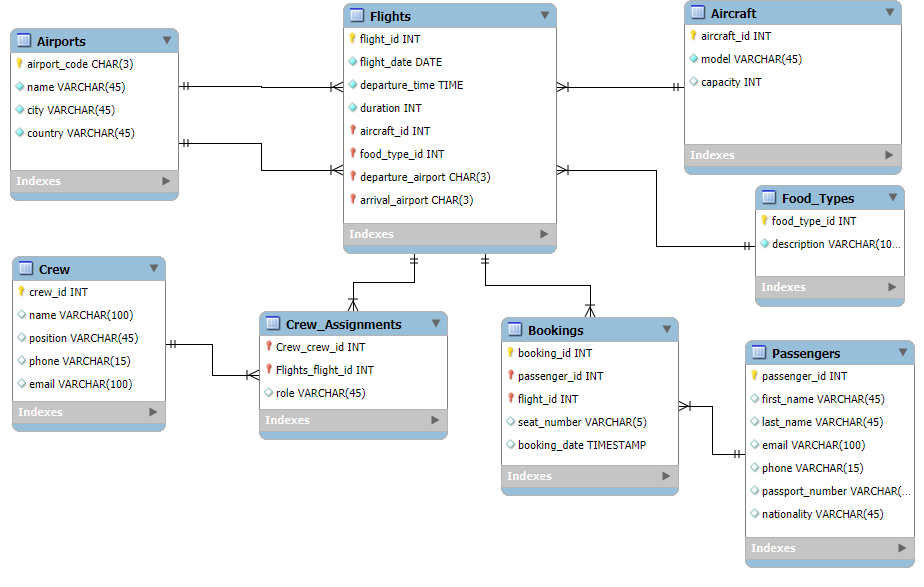

# Airline Management System

**Тема № 3: Система за менажиране на полетите на авиокомпания**

---

## Схема на ER-диаграма

<p align="center">
  
</p>

## Описание

Това е курсов проект, реализиран в две части:

1. **MySQL база данни**

   - **Таблици**: Airports, Aircraft, Food_Types, Flights, Crew, Crew_Assignments, Passengers, Bookings
   - **Релации** по ключове `PRIMARY KEY`, `FOREIGN KEY`, `UNIQUE`
   - **Тестови данни** за пълноценна демонстрация
   - **Примерни заявки**:
     - SELECT с филтриране
     - JOIN (INNER, LEFT) и вложени SELECT
     - Агрегации с `GROUP BY` (напр. заети/достъпни места)
   - **Trigger**: автоматично превръща `seat_number` в главни букви при INSERT
   - **Stored Procedure**: процедура с временна (`TEMPORARY`) таблица и курсор, която генерира месечен отчет за заетите места по полет

2. **Django уеб приложение**
   - **CRUD интерфейс** за:
     - Пътници, Самолети, Полети, Членове на екипажа, Летища, Резервации
   - **Функционалности**:
     - **Главна страница**: визуализация на всички таблици (raw data) и ER‑диаграма
     - **Flight Schedule**: разписание на полетите с връзки към резервации
     - **Book a Flight**: форма за резервация (BookFlightView)
     - **Pilot Assignments**: преглед и въвеждане на назначения на пилоти
     - **Crew Assignments**: единна страница (List+FormMixin) за назначаване на всички екипажи (пилоти и стюардеси)
     - **Detail View**: списък на пасажерите (`FlightBookingsView`) за даден полет
   - **Model–View–Template**
     - `models.py`: дефиниция на всички таблици с `managed = False` (предварително създадена в MySQL)
     - `forms.py`: `ModelForm` за всяка ентити таблица, с подходящи `widgets` за Bootstrap
     - `views.py`: комбинация от function- и class-based views за всички необходими операции
     - `templates/`:
       - `base.html` (общ layout с Bootstrap navbar)
       - `home.html`, `schedule.html`, `pilots.html`, `crew_assignments.html`, `flight_bookings.html`, `form.html`
   - **Static assets**:
     - CSS (Bootstrap от CDN + евентуален `style.css`)
     - ER‑diagram image в `static/images/er_diagram.png`

## Структура на проекта

```text
airline-management/
├── .venv/                  # виртуална среда
├── Airline_Management/     # Django проект
│   ├── __init__.py
│   ├── asgi.py
│   ├── settings.py
│   ├── urls.py
│   └── wsgi.py
├── flights/                # основно приложение
│   ├── templates/
│   │   └── flights/
│   │       ├── base.html
│   │       ├── crew_assignments.html
│   │       ├── flight_bookings.html
│   │       ├── form.html
│   │       ├── pilots.html
│   │       └── schedule.html
│   ├── templatetags/
│   │   ├── __init__.py
│   │   └── model_extras.py
│   ├── __init__.py
│   ├── forms.py
│   ├── models.py
│   ├── urls.py
│   └── views.py
├── static/
│   └── images/
│       └── er_diagram.png
├── manage.py
└── requirements.txt
```

## Използвани технологии

- **Python**
- **Django**
- **MySQL**
- **Bootstrap** (за стилове и формови компоненти)
- **Git** (версионен контрол)

---
